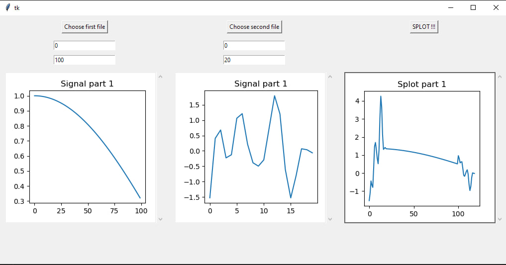

#  Metody dekompozycji sygnału
##  Praca zaliczeniowa
##  Temat: 
#  Splot zadanych dwóch sygnałów zapisanych w formie plików tekstowych (.csv) + wizualizacja

## Zadania
* Wczytanie wskazanych dwóch plików
* Wykonanie splotu sygnałów
* Wyświetlenie sygnałów w postaci oscylogramu
* Wyświetlenie sygnału wynikowego
* Zapisanie wynikowego sygnału do pliku .csv

## Jak uruchomić program?

W konsoli wpisujemy:

dla instalaacji potrzebnych bibliotek: `pip install -r requirements.txt`

dla urohomiania: `python splot_signal_app.py`

## Opis i obraski

Ekran startowy: 

Tu mozemy wystawic dlugość sygnału, oraz wybrać pliki z sygnałami

Po naciśnięciu przycisku "SPLOT!!!" program wykonuje splot sygnałów, oraz zapisuje wynik do pliku "splot_filename1_filename2.csv"

wybor plikow z sygnalami:

koncowy wynik:

obrazki sygnalow i splotu wyswietlaja sie w osobnych oknach

